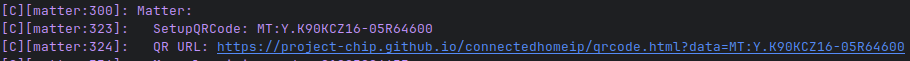
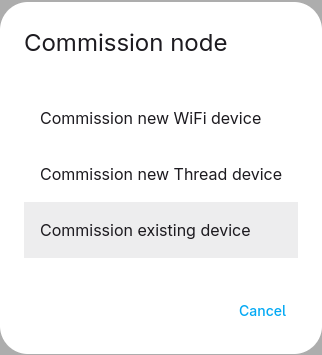

Because ESPHome already provides Wi-Fi or matter credentials, commissioning works in a different way than you're probably used to with other matter devices.

After flashing the device, a commission code is generated and shown (SetupQRCode). Copy this code or click the link and scan the QR-code.

In your matter controller you need to select the on-network commissioning option. In `python-matter-server` this is called "Commission existing device":

### Persistence

The SetupQRCode is stored in flash and survives ota updates. If you ever have to re-commission the device you can do it with the original code!

The fabric data is also stored on flash (nvs partition) and also survives ota updates. The fabric itself is independent of the hardware layer (wifi or thread). This means that it's even possible to commission a device over wifi and later substitute the wifi component with openthread (as long as the hardware supports both) and you don't need to re-commission!

### Multiple fabrics
`connectedhomeip` supports 5 fabrics by default (can be configured with the `CONFIG_MAX_FABRICS` option added to `esp32.framework.sdkconfig_options`) so `esphome-matter` also has support for multiple fabrics. However, currently there is no way to re-open the commissioning window. It's not that hard to implement and will be added in the future.
