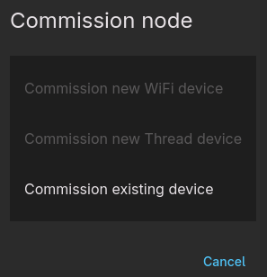

Because ESPHome already provides Wi-Fi or matter credentials, commissioning works in a different way than you're probably used to with other matter devices.

After flashing the device, a commission code is generated and shown (SetupQRCode). Copy this code or click the link and scan the QR-code.

```
[C][matter]: Matter:
[C][matter]:   SetupQRCode: MT:Y.K904QI14-O992WI00
[C][matter]:   QR URL: https://project-chip.github.io/connectedhomeip/qrcode.html?data=MT:Y.K904QI14-O992WI00
[C][matter]:   Manual pairing code: 32552014321
[C][matter]:   Commissioning window: open
[C][matter]:   Fabrics: none
```

# Commissioners

### matterjs-server / Home Assistant
To accept the dev DAC that esphome-matter uses, matterjs-server should be started with the `--enable-test-net-dcl` argument set to `true`;

  `matterjs-server --enable-test-net-dcl=true`

Or the `ENABLE_TEST_NET_DCL` environment variable should be set to `true`.

When commissioning, use the "Commission existing device" option;




### python-matter-server
Accepts the dev DAC without any problems. But python-matter-server is discontinued and replaced by matterjs-server.


##### IKEA Dirigera
In the IKEA Home smart app, add the device by opening the QR url and scanning the code.

The IKEA system doesn't like it when a device has multiple endpoints. With the example config where a button, temperature sensor and light are configured, only the temperature sensor is shown in the app. If only the light endpoint is configured it is detected correctly as a light.


# Persistence
The SetupQRCode is stored in flash and survives ota updates. If you ever have to re-commission the device you can do it with the original code!

The fabric data is also stored on flash (nvs partition) and also survives ota updates. The fabric itself is independent of the hardware layer (wifi or thread). This means that it's even possible to commission a device over wifi and later substitute the wifi component with openthread (as long as the hardware supports both) and you don't need to re-commission!

# Multiple fabrics
Up to 5 fabrics are supported by default but if needed this can be increased with the `CONFIG_MAX_FABRICS` sdkconfig option:

```yaml
esp32:
  framework:
    type: esp-idf
    sdkconfig_options:
      CONFIG_MAX_FABRICS: # Set to anything from 5 to 255
```
