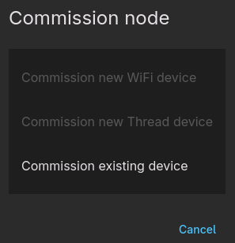

Because ESPHome already provides Wi-Fi or Thread credentials, commissioning works differently from most Matter devices.

After flashing the device, a commission code is generated and shown (SetupQRCode). Copy this code or click the link and scan the QR-code.

```
[C][matter]: Matter:
[C][matter]:   SetupQRCode: MT:Y.K904QI14-O992WI00
[C][matter]:   QR URL: https://project-chip.github.io/connectedhomeip/qrcode.html?data=MT:Y.K904QI14-O992WI00
[C][matter]:   Manual pairing code: 32552014321
[C][matter]:   Commissioning window: open
[C][matter]:   Fabrics: none
```

## Setup codes in Home Assistant

Setup codes are printed at CONFIG level during the configuration dump. Those
lines may be missed when connecting after boot or hidden by the configured log
level. To receive the codes through the native ESPHome API, add:

```yaml
api: {}

text_sensor:
  - platform: matter
    manual_pairing_code:
      name: "Matter Setup Code"
    qr_code:
      name: "Matter QR Payload"
```

Merge these entries with your existing API and text sensor configuration. Both
sensors are optional, but at least one must be configured. The optional
`matter_id` selects the Matter component; it is inferred when omitted. The
entities use the diagnostic category and are exposed by default. Their states
are generated from the stored commissioning identity at startup and remain
available when Home Assistant reconnects, without requiring a configuration
dump. `manual_pairing_code` is the decimal setup code; `qr_code` is the raw
`MT:` payload that can be encoded into a QR image.

A code value does not indicate whether the commissioning window is open or
whether Matter initialized successfully. After a Matter factory reset, the
same original code is published again and can be used during the initial
commissioning window. For an already commissioned device, use the controller's
sharing flow and its temporary code to add another fabric.

### Matter reset button

To remove all stored Matter fabrics and restart for initial commissioning:

```yaml
button:
  - platform: template
    name: "Matter Factory Reset"
    entity_category: config
    icon: mdi:restore
    on_press:
      - matter.factory_reset:
```

This keeps the stored setup code, ESPHome preferences, and the configured
Wi-Fi or Thread credentials. The device must be paired with its Matter
controllers again afterward.

# Commissioners

### matterjs-server / Home Assistant

To accept the dev DAC that esphome-matter uses, matterjs-server should be started with the `--enable-test-net-dcl` argument set to `true`;

`matterjs-server --enable-test-net-dcl=true`

Or the `ENABLE_TEST_NET_DCL` environment variable should be set to `true`.

When commissioning, use the "Commission existing device" option;



### python-matter-server

Accepts the dev DAC without any problems. But python-matter-server is discontinued and replaced by matterjs-server.

##### IKEA Dirigera

In the IKEA Home smart app, add the device by opening the QR url and scanning the code.

The IKEA system doesn't like it when a device has multiple endpoints. With the example config where a button, temperature sensor and light are configured, only the temperature sensor is shown in the app. If only the light endpoint is configured, it is detected correctly as a light.

# Persistence

The SetupQRCode is stored in flash and survives ota updates. If you ever have to re-commission the device you can do it with the original code!

The fabric data is also stored on flash (nvs partition) and also survives ota updates. The fabric itself is independent of the hardware layer (wifi or thread). This means that it's even possible to commission a device over wifi and later substitute the wifi component with openthread (as long as the hardware supports both) and you don't need to re-commission!

# Multiple fabrics

Up to 5 fabrics are supported by default, but if needed, this can be increased with the `CONFIG_MAX_FABRICS` sdkconfig option:

```yaml
esp32:
  framework:
    type: esp-idf
    sdkconfig_options:
      CONFIG_MAX_FABRICS: # Set to anything from 5 to 255
```
